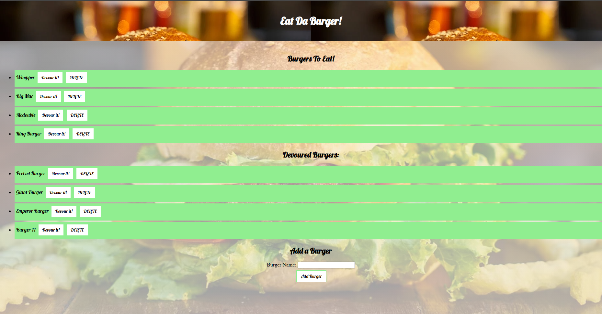

# Eat Da Burger!
 Link: https://opensource.org/licenses/MIT

## Description 
Eat-Da-Burger! is a restaurant app that lets users input the names of burgers they'd like to eat. Whenever a user submits a burger's name, your app will display the burger on the left side of the page -- waiting to be devoured. Each burger in the waiting area also has a Devour it! button. When the user clicks it, the burger will move to the right side of the page. Your app will store every burger in a database, whether devoured or not.

## Table of Contents (Optional)

* [Installation](#installation)
* [Usage](#usage)
* [Features](#features)
* [License](#license)

## Installation

Clink on the heroku link.

## Usage 

The user can create a burger in the input category, which gets sent to the waiting area. The user can then click "Devour it!" to devour the burger, and move it to the devoured section.

## License

        Copyright (C) 2020  <name of author>
        
        Permission is hereby granted, free of charge, to any person obtaining a copy of this software and associated documentation files (the "Software"), to deal in the Software without restriction, including without limitation the rights to use, copy, modify, merge, publish, distribute, sublicense, and/or sell copies of the Software, and to permit persons to whom the Software is furnished to do so, subject to the following conditions:
        
        The above copyright notice and this permission notice shall be included in all copies or substantial portions of the Software.
        
        THE SOFTWARE IS PROVIDED "AS IS", WITHOUT WARRANTY OF ANY KIND, EXPRESS OR IMPLIED, INCLUDING BUT NOT LIMITED TO THE WARRANTIES OF MERCHANTABILITY, FITNESS FOR A PARTICULAR PURPOSE AND NONINFRINGEMENT. IN NO EVENT SHALL THE AUTHORS OR COPYRIGHT HOLDERS BE LIABLE FOR ANY CLAIM, DAMAGES OR OTHER LIABILITY, WHETHER IN AN ACTION OF CONTRACT, TORT OR OTHERWISE, ARISING FROM, OUT OF OR IN CONNECTION WITH THE SOFTWARE OR THE USE OR OTHER DEALINGS IN THE SOFTWARE.

---

## Features

MySQL, Express-Handlebars, Node.js, Javascript, CSS, and ORM.

## Contributing

Leandro Parrado

## Tests

N/A

## Questions

To reach me for any questions or concerns, see below.

Github Link: https://www.github.com/Bokosyk
Email: lparrado321@gmail.com

---

© 2021. All Rights Reserved.
